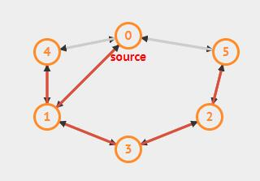

# 这是 一级标题
## 这是 二级标题

---
*这会是 斜体 的文字*
_这会是 斜体 的文字_

**这会是 粗体 的文字**
__这会是 粗体 的文字__

_你也 **组合** 这些符号_

~~这个文字将会被横线删除~~

---
* Item 1
* Item 2
  * Item 2a
  * Item 2b

1. Item 1
1. Item 2
1. Item 3
   1. Item 3a
   1. Item 3b
---


---
正如 Kanye West 所说：
（引用）
> We're living the future so
> the present is our past.
---

我觉得你应该在这里使用（行内代码）
`<addr>` 才对。

---
（代码块）
```ruby
require 'redcarpet'
markdown = Redcarpet.new("Hello World!")
puts markdown.to_html
```

---
（代码块添加语言+类+行数）
```javascript {.class1 .class}
function add(x, y) {
  return x + y
}
```

```javascript {.line-numbers}
function add(x, y) {
  return x + y
}

```

----
（任务列表）
- [x] @mentions, #refs, [links](), **formatting**, and <del>tags</del> supported
- [x] list syntax required (any unordered or ordered list supported)
- [ ] this is a complete item
- [ ] this is an incomplete item

---

First Header | Second Header
--------- | ----------
Content from cell 1 | Content from cell 2
Content in the first column | Content in the second column

---

:smile:
:fa-car:

---

30^th^
H~2~O

---
(脚注)
Content [^1]
[^1]: Hi! This is a footnote

---
（缩略）
*[HTML]: Hyper Text Markup Language
*[W3C]:  World Wide Web Consortium
The HTML specification
is maintained by the W3C.

---
==marked==

---
[extend](https://github.com/yygmind/blog/issues/7)